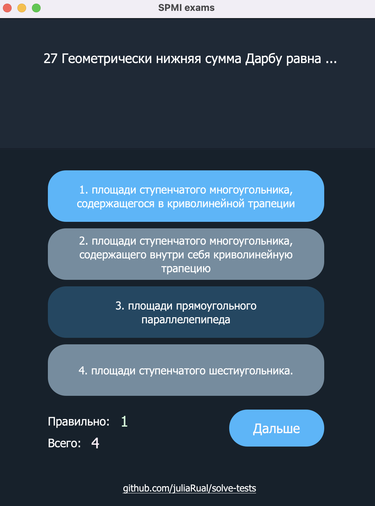

# solve-tests

Программа-заготовка для подготовки к экзаменам, путем нарешивания демо-версий тестов. 


## Установка

1. Установить PySide6
```sh
pip3 install pyside6
```
2. Запустить main.py и проверить работоспособность 


## start

1. подготовить txt файл формата: 
```sh
Сложный вопрос, на который есть только один ответ
1.Неверный ответ
2.Неверный ответ
@3.Верный ответ, у которого перед цифрой будет стоять собачка
4.Неверный ответ

```
Разные вопросы обязательно разделены пустой строкой

2. Запустить main.py

3. Выбрать заготовленный txt с базой (или попробовать txt из репозитория)

4. Подготовиться к зачету/экзамену/тесту

5. Написать мне о критических ошибках или предложениях  

<p align="center">
  
</p>

## Примечание
Это самая первая версия, есть множество ограничений. Например, слишком длинный ответ может не поместиться целиком в поле для ответа. 
